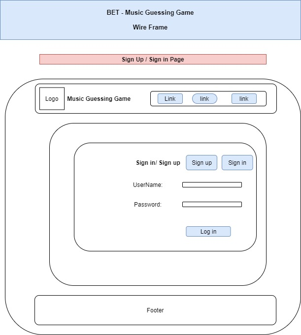
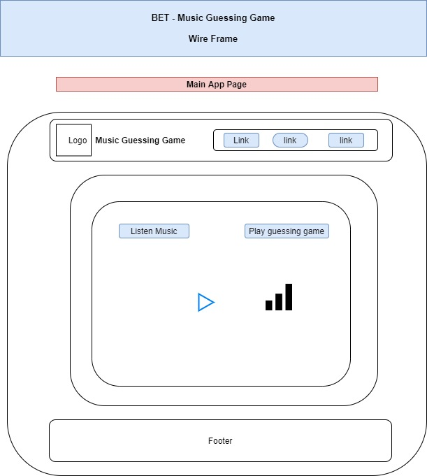
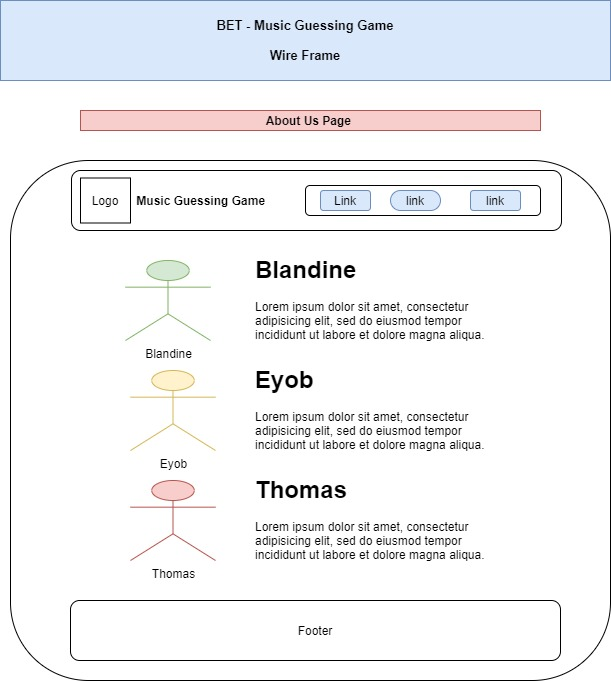
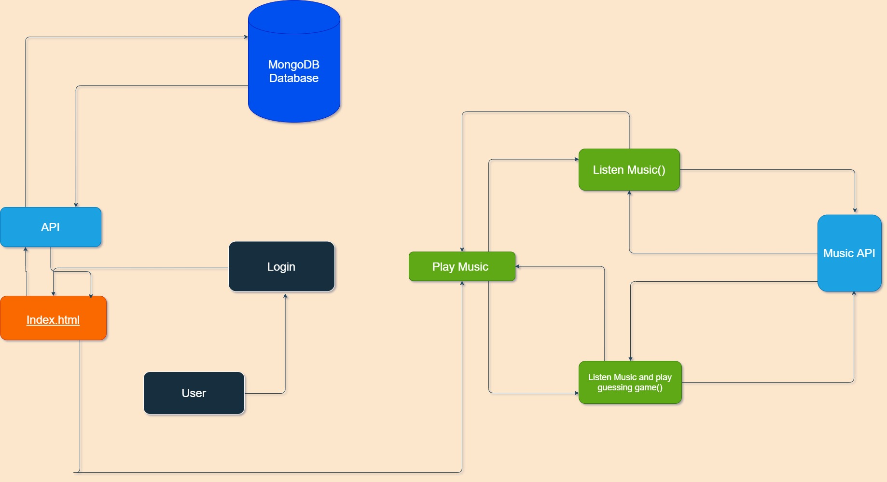

# 401-finalProject

# Project Idea

  * Create an app that will allow a user to guess the correct title and artist from a snippet of song. The user can guess the artist of the song. If the user failed to answer correctly, the app will give the user the correct answer.

### Wireframes:

### User Stories

  * As a user, I want to sign up with a user name and password.

  * As a user, I want to login with a user name and password.

  * As a user, I want to listen to music.

  * As a user, I want to be able to play a music guessing game.

  * As a user, I want to chat with another user while listening to the same music.

### Software Requirements

[Software Requirements](./requirements.md)

### Domain Modeling

 
